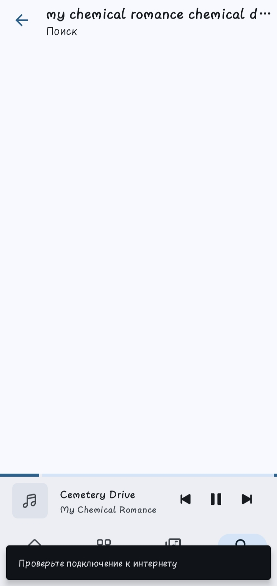
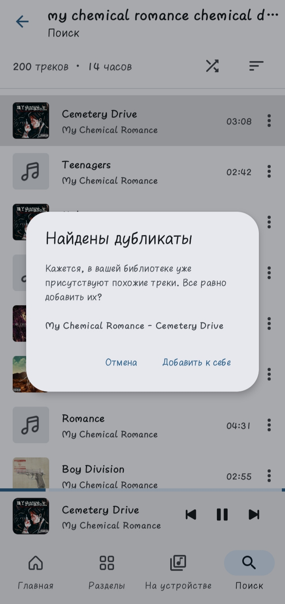
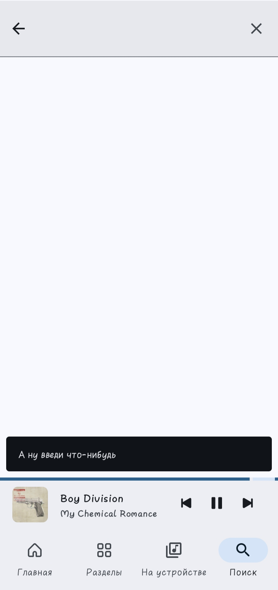
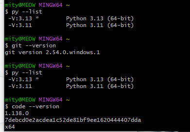

# ДОМАШНЕЕ ЗАДАНИЕ
## ПО ДИСЦИПЛИНЕ «РАЗРАБОТКА ПРОГРАММНЫХ МОДУЛЕЙ»
### **ДЗ: «№ 1»** 

| | |
| :--- | :--- |
| Студент: | Станчинская София Антоновна |
| Группа: | 9/2-РПО-25/3 (РПО9-3) |
| Дата: | 24.09.2026 |

>просрочка...надо просыпаться, пожалуй

## **Задание №1 разберите знакомый сервис**

Выбранный сервис: **Moozza** плеер (альтернативный плейер для VK, так что владелец серверов - VK)

### *1.1.0 Вход в аккаунт, первый запуск приложения*

- **Что уходит на сервер:** логин, пароль, запрос на доступ
- **Что проверяет сервер:** находит логин, сравнивает пароли (их хэши). Не находит логин - ошибка, пароли не совпадают - ошибка, логин найден и пароль совпал - доступ разрешен
- **Куда это сохраняется:** появляется активная сессия, для нее создается токен. Moozza сохраняет токен к себе, чтобы не входить при каждом действии.
- **Что возвращается обратно:** токен доступа (ключ/ "пароль" сессии). Так как в интерфейсе Moozza не отображаются имя пользователя и аватарка, сервер возвращает только сам токен и ID пользователя. 
(А уже следующим отдельным запросом приложение запросит первую порцию песен, помещающихся на экран).

### *1.1.1 Запуск приложения*

- **Что уходит на сервер:** токен и запрос на порцию песенок, если интернет медленный можно будет увидеть серые заглушки вместо названий и обложек.
- **Что проверяет сервер:** действительность токена, не была ли завершена сессия (например за счет "выхода со всех устройств"/просто кнопки "выйти")
- **Куда это сохраняется:**  на сервере максимум обновляется дата последнего визита, а Moozza обновляет кеш если появились свежие песни
- **Что возвращается обратно:**  если успешно, то первые песни из плейлиста, если нет то ошибка авторизации (если смерть настигла токен)/ ошибка сети(нет интернета)

### *1.2 Поиск песни*

- **Что уходит на сервер:** текстовый запрос, например "Three Days Grace - I Hate Everything About You", и токен сессии
- **Что проверяет сервер:** опять действительность токена, не была ли завершена сессия (например за счет "выхода со всех устройств"/просто кнопки "выйти")
- **Куда это сохраняется:** строка запроса сохраняется в базу данных истории поиска VK (чтобы выводить подсказки при будущих поисках и настраивать рекомендации)
- **Что возвращается обратно:** все совпадения по названию одним json. *(чем меньше конкретики тем более разнообразные варианты, если ввести только название группы - будут все песни группы, если ввести только название песни - будут одноименные песни от разных авторов, что очень интересно. возможно это не стоило писать тут).* Для каждой песни в файле будет словарик из : id, автора, название, url на файл песни.

### *1.3 Добавление песни к себе*

- **Что уходит на сервер:** запрос что токен "X" хочет добавить песню с ID "Y". Так же moozza берет у сервера данные была ли добавлена песня ранее, если сервер отвечает да, то выводит окошко "Найдены дубликаты". но для лайков такой запрос у Moozza не предусмотрен, только через кнопку "добавить к себе", хотя действие одно и то же...все же Moozza - инди приложение хпхп
- **Что проверяет сервер:** опять же действительность токена, а так же существование песни с таким ID.
- **Куда это сохраняется:** в базу данных VK, где лежат остальные добавленные пользователем песни (порядковый номер песни - user id - song id) + систему рекомендаций
- **Что возвращается обратно:** json ответ об успехе (или нет хаха). Потом уже при переходе во вкладку песни, они обновляются по очередному запросу и там появляются добавленные песни (конкретно в Moozza требуется обновить страницу)

## **Задание №2 найдите место для отказа**

Выбранное действие: поиск песни

### *2.1 пропажа сети на середине действия*

Если сеть пропадет на середине поиска то связь с сервером оборвется, оборвется поиск, и выскочит сетевая ошибка.

### *2.2 нажатие кнопки дважды* 
>так как нажать два раза поиск просто невозможно нажать в приложении, тут будет действие **"добавление песни к себе".** И тут выбран случай, когда ,все же, Moozza спрашивает у сервера, а так оно просто молча добавится повторно.

Если нажать кнопку "Добавить к себе" повторно, то выйдет окошко "Найдены дубликаты", так как в данном случае Moozza просит проверки наличия у серверов VK.

Предположу, что возможность дубликатов вообще существует из-за того, что VK, наверное, хранит в базе данных порядковый номер песен в профиле, или еще какое-то иное значение (дату добавления?), тогда в таблицах нету конфликта из-за дубля...

### *2.3 отправка пустого поля*

В приложении Moozza это предусмотрено предпроверкой запроса, которая выводит в случае пустоты или пробела "А ну введи что-нибудь". Но предположу, что при пустоте выводилось бы все... или ошибка 400...

## **Задание №3 соберите окружение**

>Все было установлено на практике по git...да...

Версии git, python, vs code:

